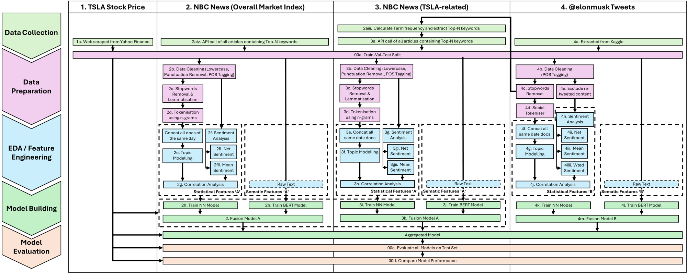

# Text-Encoded Sentiment for Long/short Alpha (TESLA)

## Overview

This project investigates the comparative influence of different text sources in supporting investment decision-making. Specifically, we will examine formal news articles from NBC that mentioned Tesla Inc. or its founder, Elon Musk, alongside informal content from Musk’s X (formerly Twitter) account (@elonmusk).

Text data, especially financial and social media text data, is inherently noisy due to a myriad of possible reasons, from irrelevant text to sensationalised headlines meant to draw views and readership. This challenge is further exacerbated by the high volume of text data present in social media sources like X, which further reduces the signal-to-noise ratio (Kolajo et al., 2022). Given the heavy reliance on accurate input data sources for model accuracy, each of this project’s five sections: 
(1) Data Collection; 
(2) Data Preparation; 
(3) Exploratory Data Analysis (EDA) & Feature Engineering; 
(4) Model Building;
(5) Model Evaluation, would seek to reduce the associated noise and/or amplify the relevant signals for subsequent steps 

## Problem Statement

## Dataset

## Approach

### Text data preprocessing library
For standardisation, a library is created at data_preprocessing.py for all the comment text processing tasks across the three data sources.
